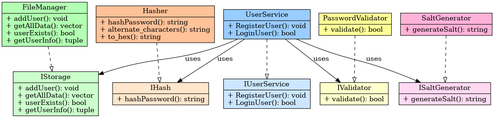

# 🔐 User Authentication System in C++

## 👥 About Us

We are a team working on a secure user authentication system using C++. The goal is to implement:
- Secure registration and login
- Password hashing and salt generation
- File-based persistent storage
- Modular code following SOLID principles

---

## 🧠 Features

- **User Registration:** Unique usernames and strong password requirements
- **User Login:** Validates input using stored salted hashes
- **Password Hashing:** Uses SHA-256 with a salt for secure storage
- **File Storage:** User data stored locally in `users.txt`
- **Hidden Password Input:** Cross-platform input hiding during password entry
- **Automated Testing:** GitHub Actions workflow using a test case file

---

## 🧱 Classes and Interfaces

- `UserService`: Handles registration and login
- `IUserService`: Interface for user service
- `FileManager`: Handles file I/O
- `IStorage`: Interface for file storage
- `Hasher`: SHA-256 + salt password hashing
- `IHash`: Interface for hashing
- `SaltGenerator`: Generates random salts
- `ISaltGenerator`: Salt generation interface
- `PasswordValidator`: Checks password strength
- `IValidator`: Interface for input validation

---

## 🖼 UML Diagram



---

## 🔁 Workflow Logic

### 🔐 Registration
1. User inputs username and password
2. Password is validated (length, chars...)
3. Random salt is generated
4. Password + salt → hash
5. Data is saved to `users.txt`

### 🔑 Login
1. User inputs username and password
2. Stored salt is retrieved
3. Password + salt → hash
4. Compare with stored hash
5. Success if hashes match

---

## 💡 SOLID Principles

- **SRP:** Each class has a single responsibility
- **OCP:** You can extend (e.g., new hash algorithm) without modifying existing code
- **LSP:** Subclasses (e.g., Hasher, FileManager) respect expected behavior
- **ISP:** Interfaces are well-separated and role-specific
- **DIP:** `UserService` depends on abstractions (`IStorage`, `IHash`, ...)

---

## 🚀 Run Locally

```bash
make
./auth_app < test_cases.txt
```

---

## ⚙️ GitHub Actions Integration

The project includes a workflow that automatically:
- Installs dependencies
- Compiles the code
- Runs test scenarios via `test_cases.txt`

Check the [`.github/workflows/auth.yml`](.github/workflows/auth.yml) for details.

---

## 👥 Team Members
- Mohamed Ali Ben Salah
- Chahin Chaabane
- Mohamed Salah Zrigua
- Nour Mrad
- Mustapha Rekik

---

## 📂 Repository Structure

```
├── main.cpp
├── user.cpp / user.h
├── file_handler.cpp / .h
├── hash.cpp / .h
├── users.txt
├── test_cases.txt
├── uml_auth_architecture.png
├── README.md
├── .vscode
└── .github/
    └── workflows/
        └── auth.yml
```
